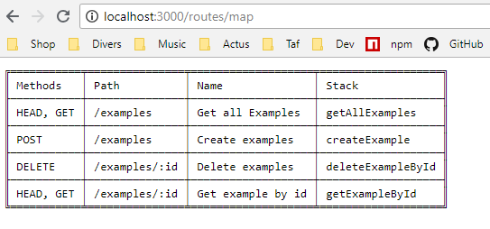
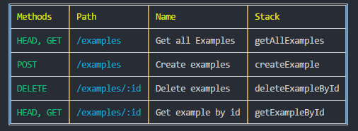
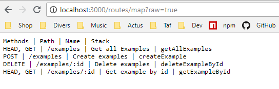

# Koa-router-map

Koa middleware to expose routes list of a koa-router.

You can find examples of how to use this library.
You can also look at the tests scenarios in the tests directory to get running examples to use.

## examples :

```js
const Koa = require('koa')
const Router = require('koa-router')
const koaRouterMap = require('koa-router-map')

const router = new Router()

router.get('Get all Examples', '/examples', async function examplesHandler(ctx) {
    ctx.body = 'OK'
})

const app = new Koa()
app.use(koaRouterMap(router))
app.use(router.routes(), router.allowedMethods())
server = app.listen(3000)
```

Open your browser or curl : `http://localhost:3000/routes/map`

It should display :



## Options

- Color mode in terminal only : `curl http://localhost:3000/routes/map?color=true`


- Raw mode : `GET http://localhost:3000/routes/map?raw=true`


## Tests

To Launch the tests :

- run : `$ npm install`
- run : `$ npm test`
- run : `$ npm run watch` : It launch test when you change the code

(The tests will run a koa app on port 9000 be sure that this port is available)

## Code Coverage

After running `$ npm test` you can access the code coverage report here : `./coverage/index.html`
